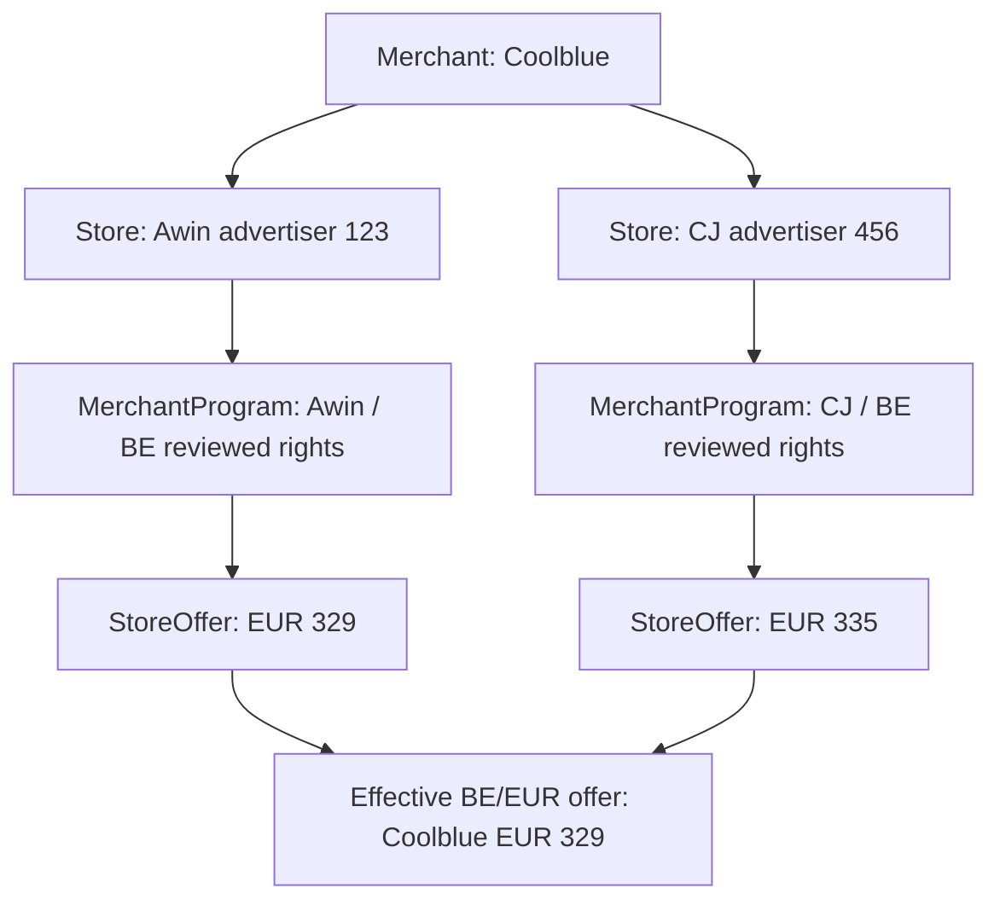

# Canonical merchants — M4D

`Merchant` is the customer-visible retailer. `Store` is the acquisition/provider source.
`MerchantProgram` is a reviewed network/market contract attached to that source.
`StoreOffer` is an exact source listing/snapshot for a canonical Product and market.
Product identity, variants and market boundaries remain independent of merchant identity.



The names and prices above are synthetic examples, not evidence of live retailer access.

## Safe identity defaults

Migration `6bde2194a7c0` follows M4C `9f62c7d40a11`. It creates one distinct Merchant
for every existing Store, copies its display name/domain/timestamps and makes
Store.merchant_id mandatory. Initial Merchant IDs equal the existing Store UUIDs;
slugs are `source-<UUID>`. Source IDs, offers, contracts, billing, observations and
notification snapshots remain unchanged. New nullable identity fields on current state,
events and clicks are backfilled only through their known source relationship.

New source creation has the same 1:1 default. A PostgreSQL BEFORE INSERT trigger handles
ORM/Core/program onboarding, serializing an exact source slug so repeated/concurrent
INSERT ON CONFLICT does not create orphan identities. Reuse of an existing acquisition
slug is not retailer reconciliation. Matching names/domains never link different Stores.
Direct eBay/WooCommerce/Amazon/Rakuten sources receive the same default. Marketplace
seller identity is not modeled here.

Merchant has an immutable unique slug, display_name, nullable primary_domain, active flag,
timestamps and an optimistic version. Domain is operator evidence only. Metadata and
active-state changes are separate operations. Source program labels/rights remain separate;
editing a program label does not rename an already established canonical retailer.

## Operator workflow

These local administrator commands are not exposed to customers over HTTP or Telegram.
Read the source/retailer evidence and current versions before changing an assignment:

```sh
uv run python -m pricehunter.apps.admin merchant-list
uv run python -m pricehunter.apps.admin merchant-show MERCHANT_UUID
uv run python -m pricehunter.apps.admin merchant-history MERCHANT_UUID
uv run python -m pricehunter.apps.admin merchant-duplicate-candidates --limit 20
uv run python -m pricehunter.apps.admin merchant-link-preview STORE_UUID TARGET_MERCHANT_UUID
```

Preview returns the source ID/network, current and target identities/versions, raw source
offer count and the explicit preservation of source policies. Duplicate candidates show
normalized domain/name evidence across networks; they are suggestions, never actions.
Pairs already sharing one Merchant are omitted. Independently establish that the retailer
is the same; sharing a domain, brand or product identifier alone is insufficient.

For an explicit new identity, save a credential-free JSON document:

```json
{"slug":"reviewed-retailer","display_name":"Reviewed retailer","primary_domain":"example.com"}
```

```sh
uv run python -m pricehunter.apps.admin merchant-create merchant.json --expected-version 0 --reason "Retail identity reviewed" --dry-run
uv run python -m pricehunter.apps.admin merchant-create merchant.json --expected-version 0 --reason "Retail identity reviewed" --confirm
uv run python -m pricehunter.apps.admin merchant-metadata MERCHANT_UUID --display-name "Reviewed name" --expected-version 1 --reason "Name reviewed" --dry-run
uv run python -m pricehunter.apps.admin merchant-metadata MERCHANT_UUID --display-name "Reviewed name" --expected-version 1 --reason "Name reviewed" --confirm
```

Metadata also accepts --primary-domain or --clear-domain. Creation expects version 0;
later changes use the current version. Slug changes are not permitted. No-op metadata
does not consume a version or create an audit entry.

Linking checks **both** Merchant versions and the Store's expected current Merchant UUID:

```sh
uv run python -m pricehunter.apps.admin merchant-source-link STORE_UUID TARGET_MERCHANT_UUID --expected-source-merchant-id CURRENT_MERCHANT_UUID --expected-source-version 1 --expected-version 2 --reason "Cross-network retailer reviewed" --dry-run
uv run python -m pricehunter.apps.admin merchant-source-link STORE_UUID TARGET_MERCHANT_UUID --expected-source-merchant-id CURRENT_MERCHANT_UUID --expected-source-version 1 --expected-version 2 --reason "Cross-network retailer reviewed" --confirm
```

Use actual current versions, not the example numbers. Dry-run validates without changing
assignments, versions or audit. Confirmation locks the source and both identities in
stable order, rejects stale receipts and appends source_unlinked/source_linked audits to
the old/new Merchant. Replaying a current receipt for an already assigned source is a
no-op. Never put secrets or customer details in metadata or audit reasons.
Reassignment first locks affected Products in UUID order, sharing watch/history evaluation's
serialization boundary before rebasing current identity pointers.

Unlink always assigns a newly created distinct Merchant, never NULL:

```sh
uv run python -m pricehunter.apps.admin merchant-source-unlink STORE_UUID --expected-source-merchant-id CURRENT_MERCHANT_UUID --expected-version 3 --reason "Distinct retailer confirmed" --dry-run
uv run python -m pricehunter.apps.admin merchant-source-unlink STORE_UUID --expected-source-merchant-id CURRENT_MERCHANT_UUID --expected-version 3 --reason "Distinct retailer confirmed" --confirm
uv run python -m pricehunter.apps.admin merchant-disable MERCHANT_UUID --expected-version 4 --reason "Retailer suspended" --confirm
uv run python -m pricehunter.apps.admin merchant-enable MERCHANT_UUID --expected-version 5 --reason "Retailer restored" --confirm
```

Enable/disable also support --dry-run. Disable makes all linked sources customer-ineligible
for comparison, tracking, history grants and outbound URLs; direct customer URL resolution
rechecks the retailer. Raw acquisition/storage remains source-specific. Existing exact
trackers stay readable but paused. Re-enable restores canonical eligibility subject to
each source's current contract, activation, cache and listing status. No records or source
permissions are deleted/edited. Empty previous Merchants remain available for audit.

MerchantAudit is append-only: UPDATE/DELETE are rejected by PostgreSQL. Versions and
related source/merchant IDs preserve the change trail. Commands never destructively merge
Merchant, Store or StoreOffer rows. The downgrade guard rejects used/reconciled identities,
operator-created Merchants and their audit. Export/reconcile deliberately before rollback;
only untouched 1:1 default identities can downgrade directly. The migration verifier's
synthetic audit cleanup occurs only inside its disposable scratch database.

## Effective customer offers

For each Product/Merchant/market/native currency, the SQL reader applies requested
surface permission first, then selects one StoreOffer with row_number, ordered by:

1. Fresh, then stale, then failed.
2. IN_STOCK, then UNKNOWN, then OUT_OF_STOCK.
3. Lower native item price.
4. Higher match confidence.
5. Newer last_checked_at.
6. Stable source UUID and offer UUID.

The catalog, tracking and history surfaces can choose different representatives because
their grants differ. Stale/failed representatives can appear as labeled known prices,
but cannot be authoritative current best. Currency groups are independent; shipping/tax
and ECB display conversions do not affect ranking. Network, commission/payout and URL
availability never enter representative selection.

The chosen StoreOffer supplies both displayed price and outbound link under its own
policy. A missing/permitted-no-URL result stays null; no other source's link is borrowed.
Signed redirect click records retain the exact offer/source/network and canonical Merchant
UUID, without customer PII. Links recheck current eligibility when opened.

`store_count` counts distinct eligible Merchant UUIDs. `offer_count`, pages and currency
statistics count effective Merchant/market/currency rows, including multiple currencies
for one Merchant. Raw counts appear only in operator diagnostics. Multiple same-source
listings for the same canonical Product also collapse within that grouping; they remain
stored independently. Window selection occurs before OFFSET/LIMIT. Three summary queries
and bounded offer/discovery/product reads avoid per-Merchant SELECTs or Python raw-offer
aggregation. Tests measure six reader queries per page at 100/500/1000 raw rows; account
context/optional FX adds existing bounded overhead.
The representative window is a MATERIALIZED CTE so underestimated planner statistics cannot
make a semijoin rerun it for each outer offer. EXPLAIN ANALYZE acceptance asserts one window
execution. Equal-priced representatives across different Merchants use canonical display
name and Merchant UUID ties; switching an acquisition source does not change that tie.

## API, watches and history

ComparisonOffer adds merchant_id, merchant_slug and source_store_id. `store` now contains
canonical Merchant.display_name. Existing `store_slug` is retained as the **source** slug
for compatibility; consumers must use merchant_id/merchant_slug for retailer identity.
`provider` remains acquisition provenance. Actual persisted results always have a Merchant;
optional DTO defaults retain compatibility with earlier in-process constructors.
Telegram reads effective rows and canonical display names, keeping network names out of
retailer labels. The offer page exposes only the representative source's exact tracking
action and destination.

ProductWatch retains best_offer_id and adds best_merchant_id. Switching Coolblue Awin
EUR329 to Coolblue CJ EUR319 can emit a normal new-best-price alert, but does not emit
merchant_became_cheapest. A real Coolblue → MediaMarkt switch retains existing event
priority/cooldown/idempotency. Identical retailer/price source switches update watch/best
provenance without creating BestPriceEvent or alert. Current ProductBestState and new
BestPriceEvent rows retain canonical Merchant and exact source offer UUIDs.

New watch snapshots include canonical identity/name, selected source Store/offer/provider
and previous canonical identity. Historical notification JSON, event names and attribution
are never rewritten. Explicit operator reassignment rebases current watch/best pointers
to avoid treating reconciliation itself as a new retailer event; historical rows/clicks
keep their identity at recording time. Exact Tracker remains tied to its original
StoreOffer and never becomes a merchant-level watch.

See [M4D design and baseline](m4d-design.md), [comparison API](comparison.md),
[coverage diagnostics](coverage-engine.md) and [verification](verification.md).
